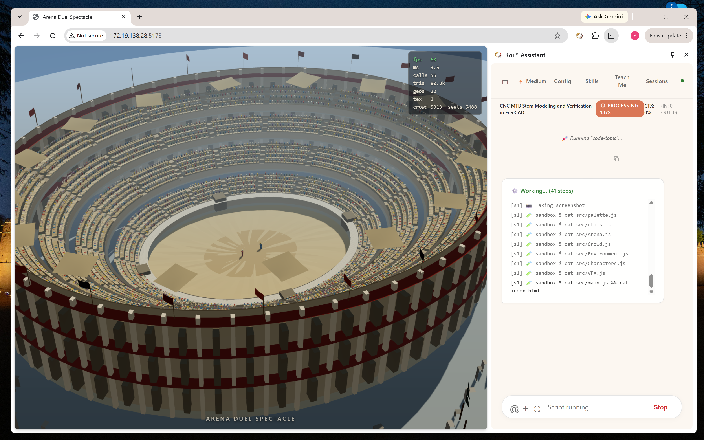

# Sandbox Shell Skill

A Koi™ Assistant skill providing a sandboxed shell execution environment.

## What It Is

The Sandbox Shell Skill lets an LLM session run terminal commands, edit code, and explore
repositories on your own machine — inside an isolated environment. Your files are visible
to the assistant but cannot be changed by it. Every write lands in a temporary overlay,
and the only way anything reaches your real repository is a git patch you review and apply
yourself.

It pairs shell execution with an LSP (Language Server Protocol) code-intelligence engine,
so the assistant can navigate symbols, search the AST, and read diagnostics rather than
grepping blindly.

The shell execution environment also provides a convenient way to connect your corporate
database as context for any Koi AI session.

Watch Koi™ Assistant complete a web coding task fully autonomously using this skill:

## [](https://youtu.be/NjI4QV28FhM?si=kWKVn-DmsiFyuOG0)

## Install

One command. The installer resolves your Node, sets up network filtering, writes a
background service, and starts it.

```sh
cd tools/gateway
./koi-gateway-installer          # installs and starts the gateway service
```

[Network filtering](#network-access) is part of that, not a second step: it checks for the
three packages it needs, offers to install them, picks a free port, and verifies the whole
chain before enabling anything. If that cannot be completed the gateway still installs —
with unfiltered network access, and a warning saying so.

**Requirements**

|                              | Needed for                         | Installed by                              |
| ---------------------------- | ---------------------------------- | ----------------------------------------- |
| Node.js 18+                  | everything                         | you (or fnm/nvm/brew)                     |
| `bubblewrap` (`bwrap`)       | filesystem isolation on Linux      | your distro, usually preinstalled         |
| `passt`, `nftables`, `squid` | network filtering                  | `./koi-gateway-installer` (it asks first) |
| `setpriv` (util-linux)       | dropping privileges in the sandbox | preinstalled on every mainstream distro   |

macOS uses the built-in `sandbox-exec` instead of bubblewrap and needs only `squid` for
network filtering.

`setpriv` is listed for completeness — it ships with util-linux, so it is already there on
any normal Linux install. It matters because it is what drops `CAP_NET_ADMIN` before your
command runs; without it the sandbox could delete its own egress filter, so network
filtering refuses to start rather than pretend. `capsh` (libcap2-bin) works too.

<details>
<summary><b>Ubuntu 22.04 and older: <code>passt</code> is not in the archive</b></summary>

`passt` was added to Debian/Ubuntu in 2023. On 22.04 (jammy) `apt install passt` reports
_"no installation candidate"_. Build it once — it takes about a minute and has no exotic
dependencies:

```sh
sudo apt-get install -y git build-essential
git clone https://passt.top/passt
cd passt && make && sudo make install
```

That installs `/usr/local/bin/pasta`, which is all the sandbox needs. Prebuilt packages for
several distributions are listed at <https://passt.top/passt/about/#try-it>.

The installer detects this case and prints these commands rather than failing on an apt
error.

</details>

**Verify it works**

```sh
./koi-gateway-installer status
node test-lower-layer-sync.mjs
node test-network-approval.mjs
```

The test script needs no browser, no assistant session, and no API key. It exercises the
real server and prints a pass/fail line per check. If you only remember one command from
this README, make it that one.

Suite 6 is the one to watch: it runs the real confinement in a throwaway namespace and
checks that a sandboxed command cannot remove its own egress filter. It needs no proxy and
no root, so it runs anywhere — and it is the check that tells you the policy is _enforced_
rather than merely _decided correctly_.

---

## Using It

In the Koi side panel, ask the assistant to work on a project. It will open the project in
a sandbox and work there. When it has something for you:

```sh
git am ~/.koi/sandbox/<session>/outbox/*.patch    # from your real repo
```

Nothing else is required. You never interact with the overlay, the gateway, or the proxy
directly.

**Try it yourself:**

```
/skill sandbox-shell/scripts/network-policy-test.js
```

Runs an interactive check in the side panel and shows you the approval dialog in action.

---

## Security Model

The short version: **the assistant can read your machine, cannot change it, and (optionally)
cannot talk to the internet without asking you.**

### Filesystem — read-only host, writes in an overlay

Your entire home directory is mounted read-only inside the sandbox. Writes go to an
overlay in `~/.koi/sandbox/<session>/`, capped at a configurable size (10 GB by default).
When the session ends, the overlay is garbage-collected. Your working tree was never
touched.

_Provided by:_ `bubblewrap` + OverlayFS on Linux; APFS copy-on-write clones and
`sandbox-exec` on macOS.

The two are not equivalent past "your files are safe": on Linux a masked credential is
absent from the filesystem, on macOS it is present but unreadable, and the macOS egress
path has no automated enforcement test. Details in the
[gateway README](../../tools/gateway/README.md#platform-parity-linux-vs-macos).

### Credentials — masked, not merely unread

SSH keys, cloud credentials, `.env` files, shell history, browser profiles and ~30 other
paths are replaced with empty directories or `/dev/null` inside the sandbox. Not hidden by
a rule the assistant could be talked out of — _absent from the filesystem it sees._

Edit `sandbox-exclude.default` to change the list, then re-run the installer.
`./koi-gateway-installer excludes` shows exactly what will be masked, without installing
anything.

### Delivery — patches, not pushes

The assistant cannot write to your repository and cannot `git push`. Finished work is
exported as a git patch series into an outbox directory that you apply by hand. This is
the only channel out of the sandbox, and it is one you read before it takes effect.

### Network access

Three modes, set in `gateway-config.json` (or by the installer):

| Mode       | What the sandbox can reach              | When to use it                                            |
| ---------- | --------------------------------------- | --------------------------------------------------------- |
| `policy`   | an allowlist, plus whatever you approve | **the default — set up by the installer**                 |
| `host`     | everything, unfiltered                  | fallback when the proxy cannot run; least protected       |
| `loopback` | nothing at all                          | offline work; dev servers become invisible to the browser |

In `policy` mode the sandbox gets its own network namespace with no route out except a
filtering proxy. Common development hosts — GitHub, npm, PyPI, crates.io, Go modules,
distro package mirrors — are allowed automatically. Anything else pauses the request and
asks you in the side panel:

> 🌐 **Network access** — `example.com`
> The sandbox is trying to reach this host while working on `~/code/myproject`.
> [Allow once] [Allow this session] [Always allow] [Deny] [Always deny]

"Always" answers are written to `~/.koi/network-policy.json` and remembered. Cloud metadata
endpoints are denied outright and cannot be approved. Dev servers you start inside the
sandbox are still reachable from your browser — that keeps working.

The waiting command is held for about 45 seconds. If you take longer, it fails with a
message telling you to retry — your answer is still recorded, so the retry goes straight
through. Nothing is lost by taking your time.

The installer already did this. These are for checking it, repairing it, or deliberately
turning it off:

```sh
./koi-gateway-installer network status
./koi-gateway-installer network on      # re-run the setup (idempotent)
./koi-gateway-installer network off     # unfiltered again
```

_Provided by:_ `pasta` (namespace networking), `nftables` (default-drop egress filter),
`squid` (the filtering proxy). Nothing is hand-rolled; the only custom piece is the small
helper that decides allow/deny and raises the dialog.

The filter is installed before your command starts, and the capability that installed it
(`CAP_NET_ADMIN`) is dropped immediately afterwards — including from the bounding set, so
it cannot be picked back up in a nested namespace. That ordering is the whole ballgame: a
sandbox that keeps the capability can undo the filter with a single `nft flush ruleset`,
and everything above it becomes decoration. If the capability cannot be dropped, no
command runs.

**What it does not protect against.** Over HTTPS the proxy sees only the host name, never
the URL or the method — approving a host allows both reads and writes to it. And with a
readable host filesystem, approving a host you don't trust is enough to leak data. Nor is
there any limit on how much data crosses an approved host. The allowlist is a real
boundary; the dialog is a decision point, not a guarantee.

---

## Configuration

Everything lives in two files you can edit and one command that applies them. For the
full operator's guide — the gateway service, `gateway-config.json`, disk retention, the
live `review` CLI, and code-intelligence prerequisites — see
[`tools/gateway/README.md`](../../tools/gateway/README.md).

| File                         | Controls                                                        |
| ---------------------------- | --------------------------------------------------------------- |
| `gateway-config.json`        | which MCP servers run, network mode, overlay size cap           |
| `sandbox-exclude.default`    | which paths are masked from the sandbox                         |
| `koi-network-allow.default`  | hosts allowed without asking (seeds the policy on first run)    |
| `~/.koi/network-policy.json` | live network policy — edited by the approval dialog, and by you |

After editing any of the first three: `./koi-gateway-installer` (re-run; it is idempotent).

Useful environment overrides:

```sh
KOI_PROXY_PORT=3200        # pin the egress proxy port
KOI_SANDBOX_EXCLUDE=a,b,c  # mask these paths instead of using the file
KOI_NODE_BIN=/path/to/node # if the installer picks the wrong Node
KOI_ASSUME_YES=1           # no prompts (scripted installs)
```

---

## How It Fits Together

```
Chrome side panel  ──WebSocket──▶  koi-gateway  ──stdio──▶  sandbox-shell-mcp
                                                                │
                                             ┌──────────────────┼──────────────────┐
                                             ▼                  ▼                  ▼
                                        bubblewrap          lsp_search        egress proxy
                                       (fs isolation)    (code intelligence)  (network policy)
```

- **`koi-gateway`** — a WebSocket-to-stdio bridge, so the browser extension can speak to
  local MCP servers. Runs as a user service (`systemd --user` or `launchd`).
- **`sandbox-shell-mcp`** — the MCP server that owns the sandbox: opens projects, builds
  overlays, runs commands, manages long-lived dev servers, exports patches.
- **`lsp_search`** — embedded code intelligence, in three tiers: LSP for semantics
  (definitions, references, diagnostics), `ast-grep` for structure, `ripgrep` for text.
- **`koi-egress`** — the filtering proxy, only when network policy is on. A separate
  service, but tied to the gateway: restarting or stopping the gateway takes it along.

---

## Troubleshooting

**`systemctl --user status koi-gateway`** and **`journalctl --user -u koi-gateway -f`** answer
most questions. Beyond that:

| Symptom                                                                    | Cause                                                       | Fix                                                                                                             |
| -------------------------------------------------------------------------- | ----------------------------------------------------------- | --------------------------------------------------------------------------------------------------------------- |
| Assistant says the sandbox is unavailable                                  | gateway not running                                         | `./koi-gateway-installer`                                                                                       |
| Every command inside the sandbox fails to reach the network                | proxy not running, or on a different port                   | `./koi-gateway-installer network on` (re-runs the whole setup)                                                  |
| Gateway log: `nothing is listening on 127.0.0.1:NNNN`, sandbox MCP exits 1 | egress proxy is down; the sandbox refuses to run unfiltered | `./koi-gateway-installer network on`; if it persists, `journalctl --user -u koi-egress -n 30`                   |
| `network on` reports missing tools                                         | `passt`/`nftables`/`squid` not installed                    | say yes when it offers to install them                                                                          |
| `E: Package 'passt' has no installation candidate`                         | Ubuntu 22.04 or older                                       | build it from source — see [Requirements](#install)                                                             |
| `port NNNN is already in use` during `network on`                          | another proxy holds it                                      | nothing to do; a free port is chosen automatically                                                              |
| Gateway log: `MISSING port NNNN is already in use`, sandbox exits          | old `koi-net-setup.sh`                                      | re-apply the current patch set; the sandbox must check that the proxy is _listening_, not that the port is free |
| A distro `squid` is running on 3128                                        | your package manager started it                             | harmless; ours runs on its own port. `sudo systemctl disable --now squid` if unwanted                           |
| A request fails with **HTTP 403 from proxy**                               | working as designed — the policy refused it                 | approve the host, or add it to the policy                                                                       |
| A request fails with **HTTP 500 from proxy**                               | the proxy gave up before you answered                       | approve the prompt and run the command again; the answer is remembered                                          |
| A request fails with **HTTP 503 from proxy**                               | allowed, but DNS or the origin failed                       | not a policy problem — the host is genuinely unreachable                                                        |
| Approval dialogs never appear                                              | no side panel attached, or filtering is off                 | `./koi-gateway-installer network status`                                                                        |
| `neither setpriv nor capsh is available ... Refusing to run`               | util-linux/libcap2-bin missing (unusual)                    | `sudo apt install util-linux` (or `libcap2-bin`); the filter must not be removable by the sandbox               |
| `could not install egress filter; refusing to run unfiltered`              | `nft` failed inside the namespace                           | working as designed — it fails closed. Check `nft` is installed and unprivileged userns is enabled              |
| A build needs a host you keep denying                                      | —                                                           | add it to `~/.koi/network-policy.json`, or click "Always allow"                                                 |

If something looks wrong, `node test-network-approval.mjs` will tell you which layer is
broken before you start reading logs.

---

## Uninstall

```sh
./koi-gateway-installer uninstall     # removes both services
rm -rf ~/.koi                         # overlays, policy, outboxes
```

Your repositories are untouched, because they always were.
diff -ruN o5/packages/chrome-extension/skills/sandbox-shell/scripts/network-policy-test.js n5/packages/chrome-extension/skills/sandbox-shell/scripts/network-policy-test.js
